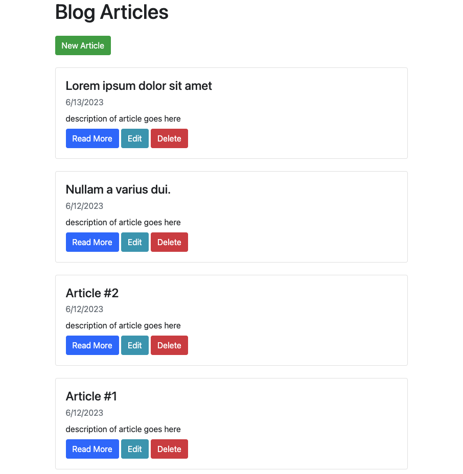

# Markdown Blog

This projecet is based from [Web Dev Simplified](https://www.youtube.com/watch?v=1NrHkjlWVhM).

This project is a blog that uses markdown. It was implemented with Node.js, Express, MongoDB, and Bootstrap.

### What I learned:

- making get, post, put, and delete requests
- managing my database with MongoDB
- creating database schemas
- sanitizing HTML
- setting different routes

### Home Page Preview:

### New Article Page Preview:

### Article Preview (Read More Option)

